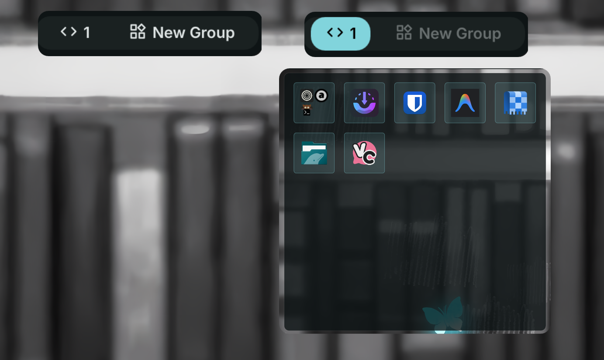

# Desktop Widget Toggle

Toggle visibility of desktop widget groups as overlay.



## Install

Use the DMS CLI:
```bash
dms plugins install desktopWidgetToggle
```

Or manually:
```bash
git clone https://github.com/hthienloc/dms-desktop-widget-toggle ~/.config/DankMaterialShell/plugins/desktopWidgetToggle
```

## Features

- **Group Desktop Widgets** - Define and manage custom groups of desktop widgets inside the settings UI.
- **Overlay Toggle** - Bring widgets in a group above all open windows (overlay layer) for quick reference, or send them back to the desktop background.
- **Single Group Focus** - Ensures only one group is active at a time to prevent overlay clutter.
- **Auto-dismiss** - Automatically dismisses active overlays after a configurable duration (0 to 15 seconds).

## Usage

| Action | Result |
|--------|--------|
| Left click group button | Toggle overlay state of that group's widgets |

*Note: While a group is active, other group buttons are disabled and visually dimmed to prevent accidental activation.*

## License

GPL-3.0
